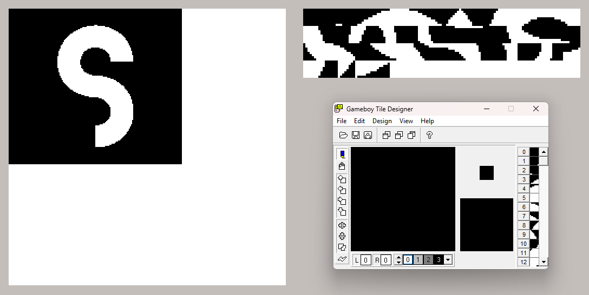

# TileGB

👉 Live Demo: https://tilegb.netlify.app/

TileGB is a web-based tool for converting images into Game Boy–compatible 8x8 tiles with deduplication and export features.  
It is designed to integrate smoothly with Game Boy Tile Designer workflows.

## Features

- Image import (multi-file support)
- 8x8 tile slicing
- Duplicate tile removal
- Flip-aware sprite deduplication
- Tile preview grid
- Export-ready image for Game Boy Tile Designer
- Project save/load system

## How to Use

1. Upload images
2. Select an image to preview and process
3. Enable sprite deduplication if needed
4. Click **Copy Image**
5. In Game Boy Tile Designer: `Edit → Split Paste`

## Planned Features

- Tilemap editor
- Palette validation tools
- Advanced optimization options

## Built With

Vanilla JavaScript, Canvas API, HTML/CSS

---

Built by Spellthorn